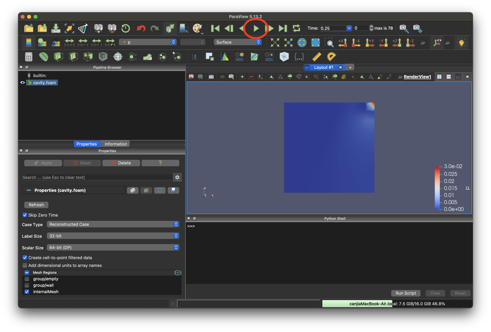

# OpenFOAM 配置记录与基础操作

[OpenFOAM 官网](https://www.openfoam.com)
[中文交流论坛（CFD中文网）](https://cfd-china.com/category/6/openfoam)

## macOS
Canjia Huang 23/2/2025 <<canjia7@gmail.com>>
- 操作平台：MacBook Air (Apple M3) - macOS 15.3
- OpenFOAM 版本：OpenFOAM-v2412

### 安装步骤
这里安装使用的是 [openfoam-app](https://github.com/gerlero/openfoam-app) ，根据其README中的步骤进行安装即可：
1. 安装 **Homebrew**
2. 终端中输入：
    `brew install --no-quarantine gerlero/openfoam/openfoam`
3. 在启动台中打开 **OpenFOAM-v2412.app** 即可

（可选）openFOAM 可以通过 paraFoam 脚本来启动可视化软件 [paraview](https://www.paraview.org) 以可视化结果，同时可以安装，根据 [brew/paraview](https://formulae.brew.sh/cask/paraview) 中步骤进行安装即可：
1. 安装 **Homebrew**
2. 终端中输入：
   `brew install --cask paraview`

### 入门操作（终端）
启动 **OpenFOAM-v2412.app** 后，会打开一个终端界面，可以在该终端界面中使用 openFOAM 的相关指令：


接下来可以通过例子测试一下，可以参考[官网相关文档-Examples](https://doc.openfoam.com/2312/examples/)
打开 **OpenFOAM-v2412.app** 后会挂载一个磁盘 **OpenFOAM-v2412**，该磁盘中 tutorials 目录下存放有一些测试案例
这里测试 /Volumes/OpenFOAM-v2412/tutorials/incompressible/pisoFoam/RAS/cavity 下的例子
 - OpenFOAM是将<u>要进行求解的问题</u>以及<u>求解器的参数</u>都存储在文件夹中的各个文件中，具体可以参考[官网相关文档-Quickstart](https://doc.openfoam.com/2312/quickstart/)，这里简要列出该案例的文件结构：
    ```
    cavity
        - 0.orig/ （包含在0时刻的初始/边界条件）
        - constant/ （包含定义着模拟中使用到的几何和物理性质的常数）
        - system/ （包含求解器参数和模拟工具等的设置）
        - Allclean （脚本）
        - Allrun （脚本）
        - Allrun-parallel （脚本）
    ```

??需要注意的是，由于默认挂载的磁盘没有读写权限，这会导致执行操作后生成的文件无法存储（可以通过改变磁盘的权限来解决，但并没有必要），所以可以先将该案例文件夹复制到本地路径，我进行复制后的测试案例文件夹路径为：/Users/canjia/CFD/cavity
由于该案例已经包含 **Allrun** 脚本，所以可以通过执行该脚本来完成整个案例的测试（一般自己的案例可能要手动分几个步骤来完成，或自己编写 **Allrun** 脚本）
在 **OpenFOAM-v2412.app** 打开的终端中输入：
```
cd /Users/canjia/CFD/cavity
./Allrun
```

成功执行后会在 /Users/canjia/CFD/cavity 目录下生成许多求解结果相关的文件

如果已经安装了 **paraview**，可以对结果进行可视化，继续在 **OpenFOAM-v2412.app** 打开的终端中输入：
```
paraFoam
```

可视化结果如下：


### 入门操作（C++）